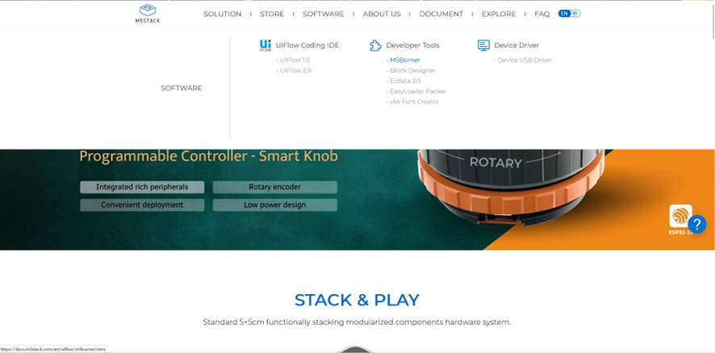
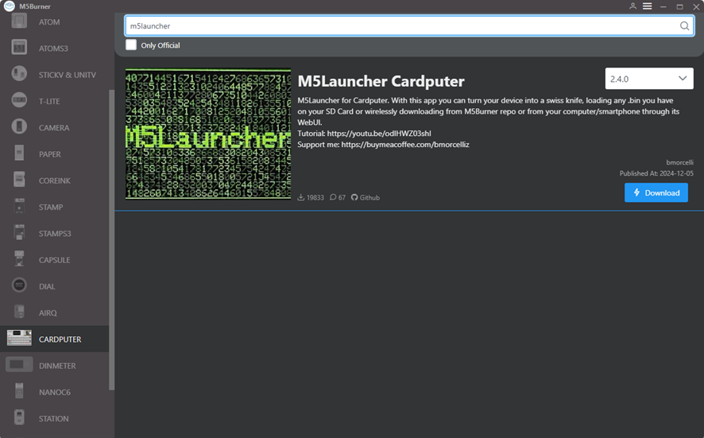
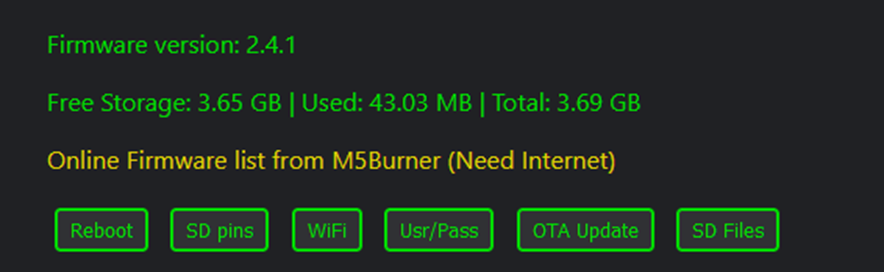
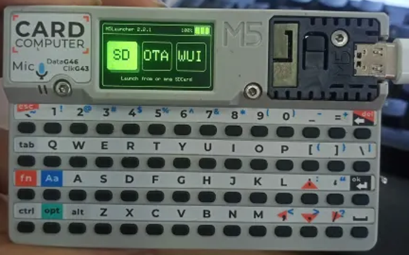
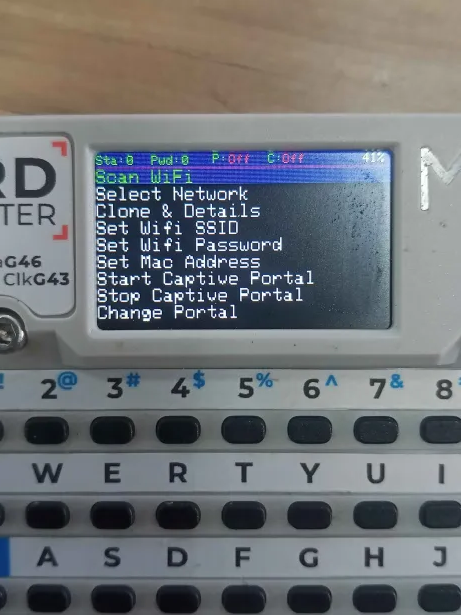
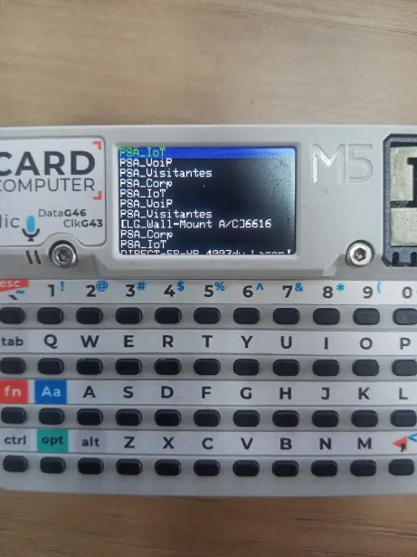
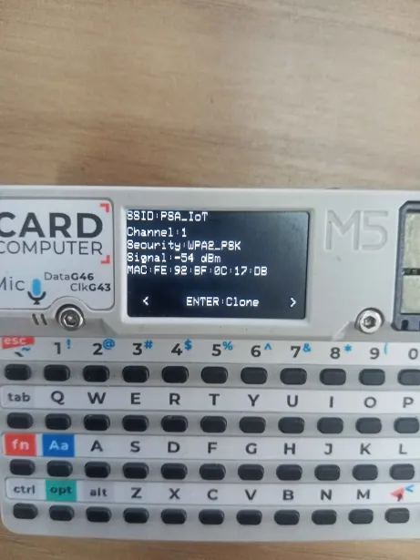

# Requisitos

- M5 Cardputer
- Cartão SD

## 1 – Instalação

### 1.1 - Preparação do cartão SD

Formate o cartão SD em Fat32.

### 1.2 - Instalação do M5 Burner

1. Acesse o site da M5Stack e procure pelo M5 Burner na aba de Softwares.
2. Faça o download do arquivo ZIP.
3. Execute o arquivo `M5Burner.exe`. Atualize o programa, se necessário.

### 1.3 – Instalação do M5Launcher

1. Dentro do M5 Burner, selecione a aba **CARDPUTER**.
2. Localize e faça o download do firmware `M5Launcher.bin`.
3. Conecte o Cardputer ao computador e clique em **Burn**.
4. Selecione a porta COM referente ao dispositivo e clique em **Start**. Não desconecte o dispositivo durante o processo de Flash.

Se a instalação for bem-sucedida, o firmware estará pronto para uso.

.png)
.png)

### 1.4 – Configurações no M5Launcher

#### 1.4.1 - Verificação do cartão SD

Na tela inicial, verifique se a opção **SD** está acessível. O ícone deve estar verde. Caso contrário, estará cinza.

#### 1.4.2 - Ativar modo Web Interface

Selecione o ícone **WUI**. Você terá as seguintes opções:

- **My Network:** Conecte-se a uma rede Wi-Fi existente, fornecendo as credenciais.
- **AP Mode:** Inicie uma rede Wi-Fi aberta hospedada pelo Cardputer.

.png)
.png)

Após escolher um método, o Cardputer exibirá um endereço IP que poderá ser acessado via navegador. Use as credenciais fornecidas pelo dispositivo para acessar a interface.

Na interface web, é possível gerenciar arquivos, monitorar o armazenamento e verificar a versão do firmware.

#### 1.4.3 - Download de Firmwares Secundários

Para habilitar o multi-boot, adicione os firmwares necessários:

1. Acesse o repositório GitHub do **Evil-Cardputer**: [Evil M5Core2 Binaries](https://github.com/7h30th3r0n3/Evil-M5Core2/tree/main/binaries).
2. Alternativamente, use a interface web para baixar o firmware em **Online Firmware List**.
3. Faça o upload do arquivo `.bin` para o Cardputer via interface web.

.png)
.png)

### 1.5 - Instalação do Evil-Cardputer

1. Desative a interface web clicando em **OK**.
2. No menu inicial, selecione **SD** e localize o arquivo `.bin` enviado.
3. Escolha **Install** e aguarde a conclusão da instalação. O dispositivo será reiniciado automaticamente.

.png)
.png)

O Cardputer está configurado e pronto para uso!

## 2 - Guia de Uso
Siga estas etapas para utilizar com eficiência cada recurso do Evil-Cardputer.

### 2.1 - Menu

- Menu Principal do firmware
  

#### 2.2 - Scan WiFi

- Realiza um scan a procura de WiFis próximos.
  

#### 2.3 - Select Network

- Escolhe uma rede WiFi da lista de WiFis escaneados , utilize as teclas de direita e esquerda para navegar no menu.
  

#### 2.4 - Clone & Details

- Informações sobre a rede escolhida, você pode clonar o SSID neste menu.
  

#### 2.5 - Start Captive Portal

- Utilizando o `normal.html`, inicia uma rede de wifi que imita uma tela de login junto de uma tela de erro.

#### 2.6 - Special Accessible Pages

- **Credentials**: Lista de credenciais capturadas.
- **Upload file On SD**: Fornece uma forma de carregar e extrair arquivos do cartão SD.
- **Check Sd File**: Fornece , download and delete files on the SD card.
- **Setup Portal**: Fornece uma página para trocar o SSID, senha e página do Access Point.
- **Run BadUSB Script**: Executa o script de BadUSB ao clicar.
- **Scan Network**: Executa um scan completo na rede.
- **Monitor Status**: Monitora por pacotes de rede.

essas páginas podem ser acessadas de diversas maneiras.

#### 2.7 - Stop Captive Portal

- **Deactivate**: Desativa o Captive Portal e DNS.

- 

