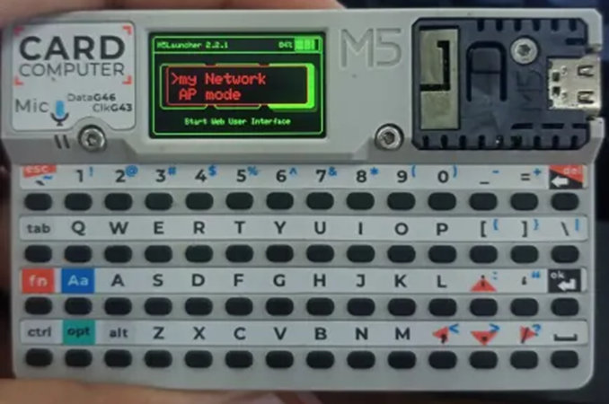

# Requisitos

- M5 Cardputer
- Cartão SD

## 1 – Instalação

### 1.1 - Preparação do cartão SD

Formate o cartão SD em Fat32.

### 1.2 - Instalação do M5 Burner

1. Acesse o site da M5Stack e procure pelo M5 Burner na aba de Softwares.
2. Faça o download do arquivo ZIP.
3. Execute o arquivo `M5Burner.exe`. Atualize o programa, se necessário.

### 1.3 – Instalação do M5Launcher

1. Dentro do M5 Burner, selecione a aba **CARDPUTER**.
2. Localize e faça o download do firmware `M5Launcher.bin`.
3. Conecte o Cardputer ao computador e clique em **Burn**.
4. Selecione a porta COM referente ao dispositivo e clique em **Start**. Não desconecte o dispositivo durante o processo de Flash.

Se a instalação for bem-sucedida, o firmware estará pronto para uso.

### 1.4 – Configurações no M5Launcher

#### 1.4.1 - Verificação do cartão SD

Na tela inicial, verifique se a opção **SD** está acessível. O ícone deve estar verde. Caso contrário, estará cinza.

#### 1.4.2 - Ativar modo Web Interface

Selecione o ícone **WUI**. Você terá as seguintes opções:

- **My Network:** Conecte-se a uma rede Wi-Fi existente, fornecendo as credenciais.
- **AP Mode:** Inicie uma rede Wi-Fi aberta hospedada pelo Cardputer.

Após escolher um método, o Cardputer exibirá um endereço IP que poderá ser acessado via navegador. Use as credenciais fornecidas pelo dispositivo para acessar a interface.

Na interface web, é possível gerenciar arquivos, monitorar o armazenamento e verificar a versão do firmware.

#### 1.4.3 - Download de Firmwares Secundários

Para habilitar o multi-boot, adicione os firmwares necessários:

1. Acesse o repositório GitHub do **Evil-Cardputer**: [Evil M5Core2 Binaries](https://github.com/7h30th3r0n3/Evil-M5Core2/tree/main/binaries).
2. Alternativamente, use a interface web para baixar o firmware em **Online Firmware List**.
3. Faça o upload do arquivo `.bin` para o Cardputer via interface web.

### 1.5 - Instalação do Evil-Cardputer

1. Desative a interface web clicando em **OK**.
2. No menu inicial, selecione **SD** e localize o arquivo `.bin` enviado.
3. Escolha **Install** e aguarde a conclusão da instalação. O dispositivo será reiniciado automaticamente.

O Cardputer está configurado e pronto para uso!
